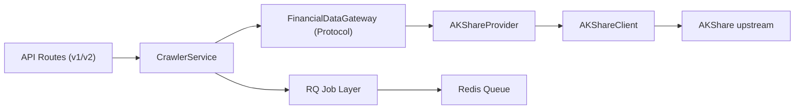

# Financial Report Analyzer 优化方案（Crawler 解耦 + API 文档 + 前端接口规划）

> 更新日期：2026-03-22
> 目标：在尽量复用开源能力的前提下，降低爬虫与业务耦合，建立稳定 API 契约，并给前端提供可演进的接入方案。

## 1. 当前优化结果（已完成）

- 已新增爬虫抽象层：`src/crawler/interfaces.py`
- 已新增 Provider 适配器：`src/crawler/providers/akshare_provider.py`
- 已新增应用层爬虫门面：`src/crawler/service.py`
- 已新增异步任务入口（RQ）：`src/crawler/jobs.py`
- API 已从直接依赖 `AKShareClient` 切到 `CrawlerService`
- 新增 v2 接口：`src/api/routes_v2.py`
- `cache_manager` 支持 redis 缺失时自动降级
- LLM 依赖改为可选加载，避免因 `langchain` 缺失拖垮全服务
- `peer_comparator` 已改造为依赖抽象网关而非直接依赖 AKShare
- `AKShareClient` 重构为稳定版本，补充报告日期容错解析
- `stock_list` 和 `financial_indicators` 增加离线/空结果兜底逻辑

## 2. 解耦架构设计



### 2.1 设计原则

1. API 层不直接依赖数据源 SDK（AKShare）
2. 上游源替换成本可控（后续接入 TuShare/自建采集器时只换 Provider）
3. 同步查询与异步刷新共存（兼容现网 + 为后续扩展留口）
4. 可降级（redis/langchain 缺失时仍可启动核心服务）

## 3. 接口文档（后端契约）

## 3.1 通用约定

- Base URL：`http://{host}:{port}`
- Content-Type：`application/json`
- 认证：当前无认证（建议后续接入 API Key / JWT）
- 时间格式：ISO8601（UTC，后缀 `Z`）

## 3.2 v1 兼容接口（保留）

| 方法 | 路径 | 说明 |
|---|---|---|
| GET | `/api/stocks/` | 股票列表 |
| GET | `/api/stocks/{code}/statements` | 三大报表最新一期 |
| GET | `/api/stocks/{code}/ratios` | 财务比率 |
| GET | `/api/stocks/{code}/dupont` | 杜邦分析 |
| GET | `/api/stocks/{code}/cashflow` | 现金流分析 |
| GET | `/api/stocks/{code}/trend?metric=net_income` | 趋势分析 |
| POST | `/api/stocks/{code}/ai-report` | AI 报告 |
| GET | `/api/stocks/{code}/export/excel` | 导出 Excel |

## 3.3 v2 新接口（推荐前端优先对接）

### 3.3.1 股票列表

- `GET /api/v2/stocks?market={optional}`

成功响应示例：

```json
[
  {
    "stock_code": "600519",
    "stock_name": "贵州茅台",
    "market": "主板"
  }
]
```

### 3.3.2 股票快照

- `GET /api/v2/stocks/{code}/snapshot?latest_only=true&refresh=false`

成功响应示例：

```json
{
  "stock_code": "600519",
  "fetched_at": "2026-03-22T06:00:00Z",
  "statements": {
    "balance_sheet": [{"stock_code": "600519", "report_date": "2025-12-31"}],
    "income_statement": [{"stock_code": "600519", "report_date": "2025-12-31"}],
    "cashflow_statement": [{"stock_code": "600519", "report_date": "2025-12-31"}]
  }
}
```

### 3.3.3 创建爬虫刷新任务

- `POST /api/v2/crawler/jobs`

请求体：

```json
{
  "stock_code": "600519"
}
```

成功响应：

```json
{
  "job_id": "a1b2c3",
  "stock_code": "600519",
  "status": "queued",
  "created_at": "2026-03-22T06:00:00Z"
}
```

### 3.3.4 查询任务状态

- `GET /api/v2/crawler/jobs/{job_id}`

成功响应：

```json
{
  "job_id": "a1b2c3",
  "status": "finished",
  "result": {
    "stock_code": "600519",
    "balance_count": 5,
    "income_count": 5,
    "cashflow_count": 5
  },
  "error": null
}
```

## 3.4 错误码建议（建议 v2 统一落地）

| HTTP | code | 场景 |
|---|---|---|
| 400 | `INVALID_ARGUMENT` | 参数非法 |
| 404 | `DATA_NOT_FOUND` | 股票或报表不存在 |
| 429 | `UPSTREAM_RATE_LIMITED` | 上游限流 |
| 503 | `DEPENDENCY_UNAVAILABLE` | redis/rq 不可用 |
| 500 | `INTERNAL_ERROR` | 服务内部错误 |

建议统一错误结构：

```json
{
  "code": "DATA_NOT_FOUND",
  "message": "No financial statements for 600519",
  "request_id": "..."
}
```

## 4. 前端接口规划（Vite + React + TypeScript）

## 4.1 分层结构

```text
frontend/
  src/
    api/
      generated/         # OpenAPI 生成代码
      client.ts          # axios/fetch 实例
      crawler.ts         # 手写补充 API
    hooks/
      useStocks.ts
      useSnapshot.ts
      useCrawlerJob.ts
    features/
      stock-list/
      stock-detail/
      report-center/
```

## 4.2 推荐接入策略

1. 用 OpenAPI 生成类型与客户端（`openapi-typescript` 或 `orval`）
2. 用 TanStack Query 管理请求缓存、重试、轮询
3. 对长任务接口（job）采用“创建任务 + 轮询状态”模式
4. 保留 v1 只做兼容，新增页面全部接 v2

## 4.3 页面到接口映射

| 页面模块 | 主要接口 | 说明 |
|---|---|---|
| 股票搜索页 | `GET /api/v2/stocks` | 支持市场筛选 |
| 股票详情页 | `GET /api/v2/stocks/{code}/snapshot` | 报表基础数据 |
| 数据刷新按钮 | `POST /api/v2/crawler/jobs` | 提交异步刷新 |
| 刷新状态组件 | `GET /api/v2/crawler/jobs/{job_id}` | 轮询到 finished |
| 分析面板 | v1 分析接口（后续迁 v2） | 先保兼容，后统一 |

## 4.4 前端迭代阶段

1. Phase A：替换 mock 数据，接入 `stocks` + `snapshot`
2. Phase B：接入 job 流程，支持刷新进度
3. Phase C：把 ratios/dupont/cashflow/trend 收敛到 v2
4. Phase D：加 E2E 与契约测试（Playwright + MSW）

## 5. 开源轮子复用清单（能抄不写）

官方文档链接（便于快速落地）：

- RQ: https://python-rq.org/docs/
- Tenacity: https://tenacity.readthedocs.io/
- FastAPI OpenAPI: https://fastapi.tiangolo.com/tutorial/first-steps/
- openapi-typescript: https://openapi-ts.dev/
- Orval: https://orval.dev/
- TanStack Query: https://tanstack.com/query/latest/docs/framework/react/overview
- Scrapy: https://docs.scrapy.org/
- Crawlee for Python: https://crawlee.dev/python/

## 5.1 已落地

| 组件 | 价值 | 状态 |
|---|---|---|
| `tenacity` | 通用重试/退避，替代手写 retry | 已接入 Provider |
| `rq` | 轻量异步任务队列，替代自研 job engine | 已接入 jobs |

## 5.2 建议优先引入

| 组件 | 复用方向 | 优先级 |
|---|---|---|
| `openapi-typescript` / `orval` | 前端 API SDK 自动生成 | P0 |
| `@tanstack/react-query` | 缓存、重试、轮询、失效控制 | P0 |
| `MSW` | 前端本地 mock 与契约回归 | P1 |
| `scrapy` | 大规模结构化采集（批量任务） | P1 |
| `playwright` / `crawlee` | JS 渲染页面采集 | P1 |
| `requests-cache` | 非 redis 场景下的 HTTP 缓存 | P2 |

## 5.3 轮子选型建议

- 当前项目以金融数据接口采集为主，不建议一开始引入重型分布式框架
- `RQ + Redis` 对当前复杂度最合适，先满足异步刷新和失败重试
- 只有当任务规模明显提升（比如每日数万股票任务）再考虑 Celery/Kafka

## 6. 其他优化规划（除爬虫外）

## 6.1 可观测性

- 增加 `request_id` 与结构化日志字段
- 统计接口耗时、上游成功率、缓存命中率
- 增加 `/metrics` 供 Prometheus 抓取

## 6.2 数据质量

- 增加报表字段完整度检查（缺失率、时间连续性）
- 增加异常值告警（同比/环比异常跳变）
- 建立数据回放测试样本（黄金数据集）

## 6.3 稳定性

- 将 v1/v2 路由补齐统一错误模型
- 为 Provider 添加速率限制器（避免上游封禁）
- 对任务队列增加超时、重试上限、死信策略

## 6.4 工程治理

- Pydantic V2 `ConfigDict` 迁移（消除 deprecation warning）
- FastAPI lifespan 替换 `on_event`（消除 deprecation warning）
- 增加 pre-commit（ruff + mypy + pytest）

## 7. 建议里程碑

### M1（1周）

- 前端接入 v2 `stocks` + `snapshot`
- 补齐 v2 错误码模型
- 增加 job 状态轮询组件

### M2（2-3周）

- 分析接口向 v2 收敛
- 增加监控指标与告警
- 增加契约测试

### M3（4周+）

- 评估 Scrapy/Crawlee 场景化接入
- 统一异步任务治理（重试策略、失败回放）
- 形成“数据采集 SLA”仪表盘

