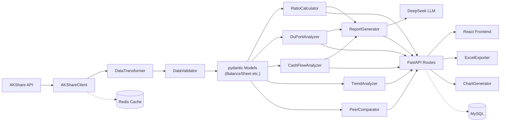

# 🏗️ 核心类/方法标准表 (Class & Method Reference)

> **范围**：仅列出会被跨模块调用的核心类和方法  
> **格式**：每个函数标明 输入 → 输出 → 被谁调用 → 流向哪里

---

## 一、数据采集层 (`src/data_fetcher/`)

### `AKShareClient`
>
> 文件：`akshare_client.py`  
> 职责：封装所有 AKShare API 调用，返回 pydantic 模型

| 方法 | 输入 | 输出 | 被调用方 |
|------|------|------|---------|
| `fetch_balance_sheet(stock_code: str)` | 股票代码 `str` | `List[BalanceSheet]`（多个报告期） | `routes_analysis.py`, `ratio_calculator.py` |
| `fetch_income_statement(stock_code: str)` | 股票代码 `str` | `List[IncomeStatement]` | `routes_analysis.py`, `ratio_calculator.py` |
| `fetch_cashflow_statement(stock_code: str)` | 股票代码 `str` | `List[CashFlowStatement]` | `routes_analysis.py`, `cashflow_analyzer.py` |
| `fetch_financial_indicators(stock_code: str)` | 股票代码 `str` | `Dict[str, Any]`（AKShare 原始指标） | `ratio_calculator.py` |
| `fetch_realtime_quote(stock_code: str)` | 股票代码 `str` | `StockQuote` | `routes_stock.py` |
| `fetch_stock_list()` | 无 | `List[StockInfo]` | `routes_stock.py` |

**数据流向**：`AKShareClient` → `DataTransformer`（中文列名转英文）→ `DataValidator`（精度校验）→ 返回 pydantic 模型

---

### `CacheManager`
>
> 文件：`cache_manager.py`  
> 职责：Redis 缓存管理，避免频繁请求 AKShare

| 方法 | 输入 | 输出 | 被调用方 |
|------|------|------|---------|
| `get(key: str)` | 缓存键 | `Optional[Any]` | 所有需要缓存的地方 |
| `set(key: str, value: Any, ttl: int = 3600)` | 键, 值, 过期秒数 | `None` | `AKShareClient` 内部 |
| `invalidate(pattern: str)` | 键模式（支持通配符） | `int`（删除数量） | 手动清除缓存时 |

---

## 二、数据处理层 (`src/processor/`)

### `DataTransformer`
>
> 文件：`data_transformer.py`  
> 职责：AKShare 返回的中文列名 DataFrame → 英文变量名 DataFrame

| 方法 | 输入 | 输出 | 被调用方 |
|------|------|------|---------|
| `chinese_to_english(df: pd.DataFrame, statement_type: str)` | 中文列名 DF + 报表类型 | 英文列名 DF | `AKShareClient` |
| `lookup_english_name(chinese_name: str)` | 中文字段名 | `str`（英文名） | 工具函数，供调试用 |
| `fuzzy_match(alias: str)` | 任意别名（如"净利率"） | `str`（标准英文名） | 前端搜索、用户查询 |

---

### `DataValidator`
>
> 文件：`data_validator.py`  
> 职责：验证金额/数量精度，确保 Decimal 转换正确

| 方法 | 输入 | 输出 | 被调用方 |
|------|------|------|---------|
| `validate_balance_sheet(bs: BalanceSheet)` | 资产负债表实例 | `ValidationResult` | `AKShareClient` |
| `validate_income_statement(is_: IncomeStatement)` | 利润表实例 | `ValidationResult` | `AKShareClient` |
| `validate_cross_check(bs, is_, cf)` | 三表联查 | `ValidationResult` | `routes_analysis.py` |

`ValidationResult` 包含：`is_valid: bool`, `errors: List[str]`, `warnings: List[str]`

---

### `DataCleaner`
>
> 文件：`data_cleaner.py`  
> 职责：处理空值、异常值、数据标准化

| 方法 | 输入 | 输出 | 被调用方 |
|------|------|------|---------|
| `clean(df: pd.DataFrame)` | 原始 DataFrame | 清洗后 DataFrame | `AKShareClient` |
| `fill_missing(df: pd.DataFrame, strategy: str)` | DF + 策略("zero"/"forward"/"drop") | DF | `clean()` 内部 |

---

## 三、分析引擎层 (`src/analyzer/`)

### `RatioCalculator`
>
> 文件：`ratio_calculator.py`  
> 职责：计算所有财务比率

| 方法 | 输入 | 输出 | 被调用方 |
|------|------|------|---------|
| `calc_profitability(bs: BalanceSheet, is_: IncomeStatement)` | 资产负债表, 利润表 | `ProfitabilityMetrics` | `routes_analysis.py`, `report_generator.py` |
| `calc_solvency(bs: BalanceSheet)` | 资产负债表 | `SolvencyMetrics` | `routes_analysis.py`, `report_generator.py` |
| `calc_efficiency(bs: BalanceSheet, is_: IncomeStatement)` | 资产负债表, 利润表 | `EfficiencyMetrics` | `routes_analysis.py`, `report_generator.py` |
| `calc_all(bs, is_, cf)` | 三大报表 | `AllRatios` | `routes_analysis.py` |

---

### `DuPontAnalyzer`
>
> 文件：`dupont_analyzer.py`  
> 职责：杜邦分析三因素分解

| 方法 | 输入 | 输出 | 被调用方 |
|------|------|------|---------|
| `analyze(bs: BalanceSheet, is_: IncomeStatement)` | 资产负债表, 利润表 | `DuPontResult` | `routes_analysis.py`, `report_generator.py` |

`DuPontResult` 包含：`roe`, `net_profit_margin`, `total_asset_turnover`, `equity_multiplier`（ROE = 净利率 × 周转率 × 权益乘数）

---

### `TrendAnalyzer`
>
> 文件：`trend_analyzer.py`  
> 职责：趋势分析（同比、环比、多年走势）

| 方法 | 输入 | 输出 | 被调用方 |
|------|------|------|---------|
| `calc_yoy(current: Decimal, previous: Decimal)` | 当期值, 同期值 | `Decimal`（增长率） | `routes_analysis.py` |
| `calc_qoq(current: Decimal, previous: Decimal)` | 当期值, 上期值 | `Decimal` | 同上 |
| `multi_period_trend(data_list: List, metric: str)` | 多期数据, 指标名 | `TrendResult` | `routes_analysis.py`, `chart_generator.py` |

---

### `CashFlowAnalyzer`
>
> 文件：`cashflow_analyzer.py`  
> 职责：现金流质量分析

| 方法 | 输入 | 输出 | 被调用方 |
|------|------|------|---------|
| `analyze(cf: CashFlowStatement, is_: IncomeStatement)` | 现金流量表, 利润表 | `CashFlowResult` | `routes_analysis.py`, `report_generator.py` |
| `calc_free_cashflow(cf: CashFlowStatement)` | 现金流量表 | `Decimal` | `analyze()` 内部 |

`CashFlowResult` 包含：`free_cash_flow`, `cash_to_income_ratio`, `operating_quality_score`

---

### `PeerComparator`
>
> 文件：`peer_comparator.py`  
> 职责：同行业横向对比

| 方法 | 输入 | 输出 | 被调用方 |
|------|------|------|---------|
| `compare(target: str, peers: List[str])` | 目标股票代码, 对标代码列表 | `ComparisonResult` | `routes_analysis.py` |

---

## 四、LLM 分析层 (`src/llm_engine/`)

### `LLMClient`
>
> 文件：`llm_client.py`  
> 职责：封装 DeepSeek API 调用（通过 LangChain）

| 方法 | 输入 | 输出 | 被调用方 |
|------|------|------|---------|
| `chat(prompt: str, system_prompt: str = "")` | 提示词 | `str` | `ReportGenerator` |
| `structured_output(prompt: str, schema: type)` | 提示词 + pydantic 模型类 | pydantic 实例 | `ReportGenerator` |

---

### `ReportGenerator`
>
> 文件：`report_generator.py`  
> 职责：生成 AI 分析报告

| 方法 | 输入 | 输出 | 被调用方 |
|------|------|------|---------|
| `generate(stock_code: str, ratios: AllRatios, dupont: DuPontResult, cashflow: CashFlowResult)` | 代码 + 全部分析结果 | `AnalysisReport` | `routes_report.py` |

---

## 五、导出层 (`src/export/`)

### `ExcelExporter`
>
> 文件：`excel_exporter.py`

| 方法 | 输入 | 输出 | 被调用方 |
|------|------|------|---------|
| `export_statements(stock_code: str, bs, is_, cf)` | 代码 + 三表 | `bytes`（xlsx 文件流） | `routes_report.py` |
| `export_analysis(stock_code: str, ratios, dupont, report)` | 代码 + 分析结果 | `bytes` | `routes_report.py` |

### `ChartGenerator`
>
> 文件：`chart_generator.py`

| 方法 | 输入 | 输出 | 被调用方 |
|------|------|------|---------|
| `revenue_trend(data: List)` | 多期营收数据 | `bytes`（PNG 图片） | `routes_report.py`, `ExcelExporter` |
| `dupont_decomposition(result: DuPontResult)` | 杜邦结果 | `bytes` | 同上 |
| `ratio_radar(ratios: AllRatios)` | 全部比率 | `bytes` | 同上 |

---

## 六、API 路由层 (`src/api/`)

| 路由 | HTTP 方法 | 输入 | 输出 | 调用链 |
|------|----------|------|------|--------|
| `/api/stocks` | `GET` | `?keyword=茅台` | `List[StockInfo]` | `AKShareClient.fetch_stock_list()` |
| `/api/stocks/{code}` | `GET` | 路径参数 | `StockDetail` | `AKShareClient` → 多个方法 |
| `/api/stocks/{code}/statements` | `GET` | `?report_date=2024-12-31` | 三表数据 | `AKShareClient` → `DataTransformer` → `DataValidator` |
| `/api/stocks/{code}/ratios` | `GET` | 路径参数 | `AllRatios` | `AKShareClient` → `RatioCalculator.calc_all()` |
| `/api/stocks/{code}/dupont` | `GET` | 路径参数 | `DuPontResult` | `AKShareClient` → `DuPontAnalyzer.analyze()` |
| `/api/stocks/{code}/trend` | `GET` | `?years=3` | `TrendResult` | `AKShareClient` → `TrendAnalyzer` |
| `/api/stocks/{code}/ai-report` | `POST` | `{depth: "detailed"}` | `AnalysisReport` | 全链路 → `ReportGenerator.generate()` |
| `/api/stocks/{code}/export/excel` | `GET` | 路径参数 | `.xlsx` 文件流 | `ExcelExporter.export_analysis()` |

---

## 七、数据流全景图

